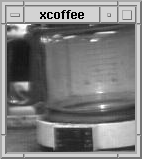
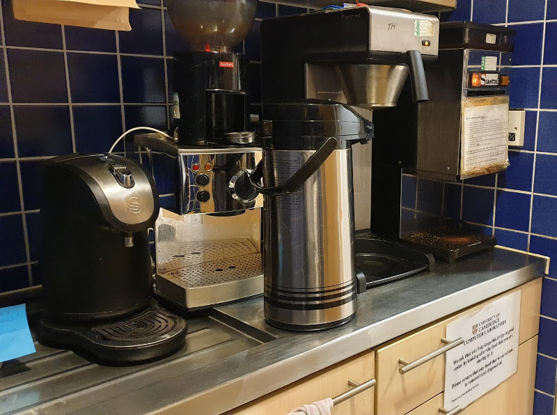
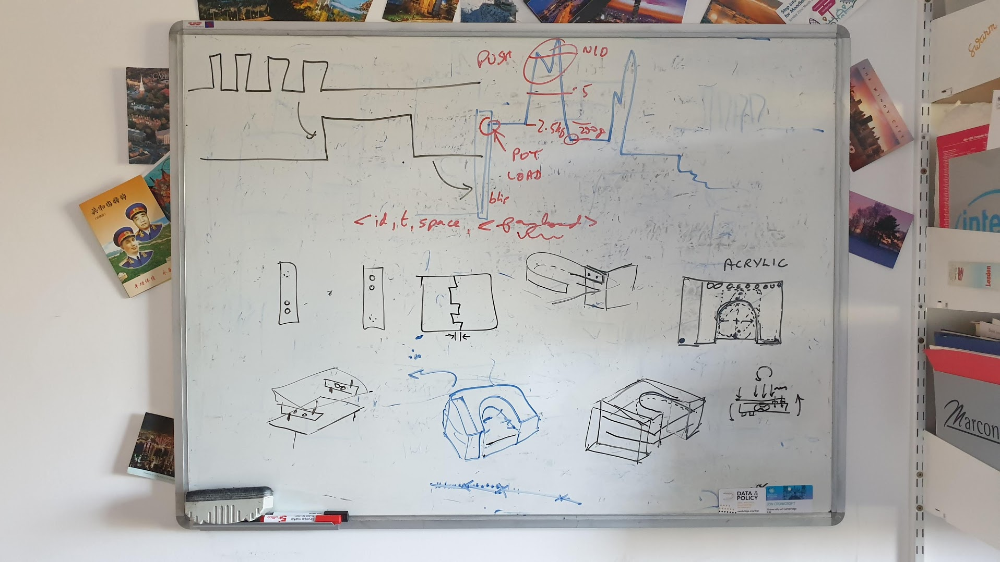
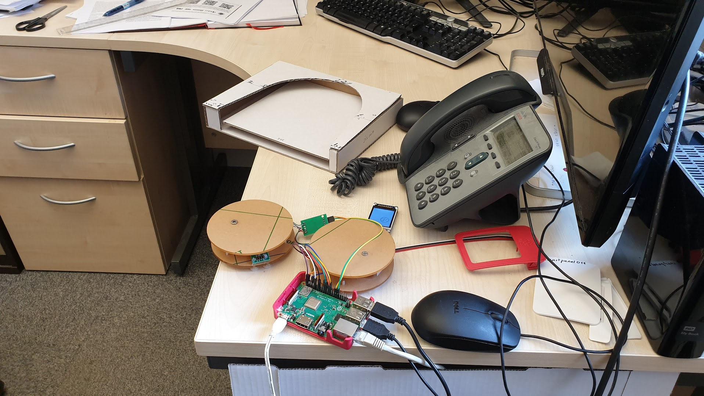
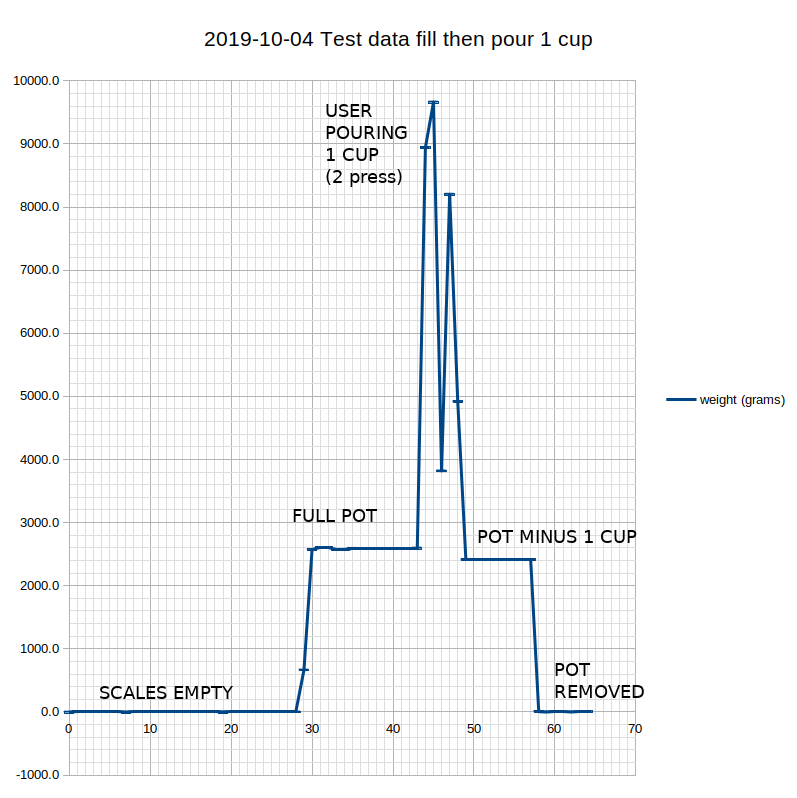
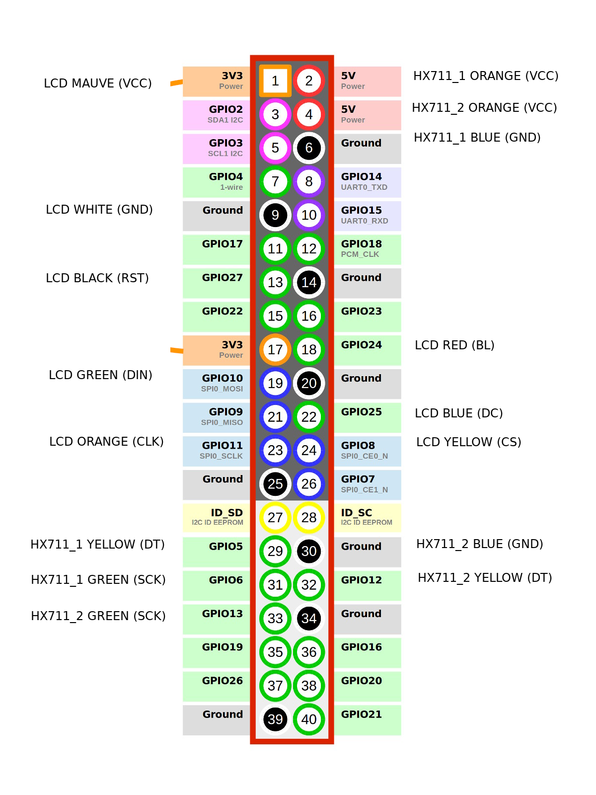

# Cambridge Coffee Pot

Back in the day (1991) we had this coffee pot with a low-res monochrome camera connected to
a frame-grabber and a server in the Computer Laboratory, then in the Austin Building in central
Cambridge.  We could type the command ```xcoffee``` on our workstations and decide whether to make
the arduous trip around to the coffee machine or lurk in our offices until some worthy colleague had
made a fresh pot of coffee. When the world-wide-web first became a thing we connected the frame grabber
to a web server and were surprised how many people around the world wanted to see a 'webcam' (the word wasn't
yet invented) and the rest is history (see [Trojan Room coffee pot](https://en.wikipedia.org/wiki/Trojan_Room_coffee_pot)).



Well, here we are ~30 years later in a somewhat shinier modern Computer Laboratory out at West Cambridge, but
the endemic coffee dependency remains a central theme, with our kitchen looking like this:



So the question is, should we have a **new** coffee sensor and if so what would it look like in 2019 vs 1991?


## The concept

Build a sensor set that measures and transmits in real-time the coffee-making
and consuming events happening on the Computer Lab Cambridge Coffee Pot.

This is actually monitoring the direct descendant of the original
Cambridge [Trojan Room coffee pot](https://en.wikipedia.org/wiki/Trojan_Room_coffee_pot)
from 1991 to 2001.



## Prototype

2019-10-09



It will take weight measurements as in the sample data illustrated below, and recognize events
such as a fresh pot of coffee being placed. The objective is that these events are communicated
to the server with the minimum latency.



## Real-time events

Embedded in the coffee pot sensor are two load cells that measure the weight of the pot.

In the data-sensing business, everybody, and I mean everybody, assumes the sensor design is finished
after the first
few lines of code are written that actually manages to read the parameter being measured and send the results.
This is understandable as often they will have spent weeks or months just trying to get the measurement sensor
to actually work reliably.

The effect of this is you end up with a 'weight sensor' that either has a built in period for repeatedly sending its reading, or it can be 'polled' by a server somewhere that periodically asks for its reading. Either
way you end up with a sensor that doesn't really care about the thing it's measuring, and neither does the server, so long as the data flow adheres to the once-a-minute (or whatever) regular schedule.

Maybe someone comes along and asks for the data with less system-related latency. The sensor / system developer
will always, and I mean always, respond with one of two answers: (1) you don't need the data more quickly, or (2) shall I send the data twice as 'fast' (i.e. every 30 seconds).

The truth is the required 'timeliness' (or acceptable latency) of the reading depends considerably on the state of the the thing being measured.  E.g. A traffic speed sensor on a highway that sends the prevailing traffic speed once a minute is better than no sensor, but there is no good reason it would send the readings "72,75,71,69,0" at regular intervals. Hopefully that last reading of ZERO could be sent within a millisecond of being measured, rather the possibly waiting 59 seconds to send it as a regular update. And a design that simply sends the measured speeds *every* millisecond is pretty dumb.

This issue regarding the timeliness of sensor data is pervasive, particularly in urban and in-building sensor systems.

Our coffee pot will connect to our existing real-time Intelligent City Platform (which itself can process
incoming events without introducing system-related polling latencies) and will
* send the weight periodically, say once per five minutes - this is best thought of as a 'watchdog' which
happens to carry a useful payload.
* recognize the following events and transmit them to the platform as soon as they are recognized:
    * POT_REMOVED - the pot appears not to be present
    * POT_NEW - freshly made coffee seems to have appeared
    * POT_POURED - a cup was poured
    * POT_EMPTY - pot appears to contain no coffee
    * COFFEE_GROUND - by also monitoring coffee grinding machine (with a microphone), it seems coffee has been ground.

## Visualizing the data

This is an open question at the moment. The original coffee pot presented the data as a 128x128px monochrome
image and it was left to the viewer how to interpret it, combined with an implicit assumption the user would
issue the ```xcoffee``` command at the time they were interested in the coffee.

The new design can assume the permanent connection of web-based displays (in addition to the 'user request'
model) and we will consider (i.e. measure) the latency in the system reporting a fresh pot of coffee.

It has been suggested that any self-respecting coffee machine in 2019 would have a Twitter account. [[ref]](#ref_1)


## Development install

```
git clone https://github.com/ijl20/cambridge_coffee_pot
```

This repo includes working python libraries for:

* the hx711 D/A chip commonly used to connect load cells (code/hx711_ijl20/hx711.py)
* the st7735 LCD drive chip commonly used with inexpensive small LCD displays (code/st7735_ijl20/st7735.py)

The ```code``` directory contains a bunch of other libraries for the hx711 and the st7735 which were a reasonable source of clues but needed improvement.

Python support for http POST of sensor data:

```
pip install requests
```

## Components

### CPU

For this one-off experimental sensor we used a Raspberry Pi 3B+, using the GPIO pins to
connect the LCD display (via SPI) and the two load cell A/D converters (each needing +Vcc, GND and two data
pins)



### Weight sensor

Two 5Kg load cells connected via two HX711 A/D converters.

### LCD Display - Waveshare 1.8inch color LCD module

[Online info](https://www.waveshare.com/wiki/1.8inch_LCD_Module)

E.g. [available Amazon UK](https://www.amazon.co.uk/Waveshare-1-8inch-LCD-Module/dp/B077YFTMVT)

#### Load cells for weight sensing the coffee pot

E.g. [available Amazon UK](https://www.amazon.co.uk/gp/product/B07GRGT3C3)

#### HX711 A/D converter for load cells

[HX711 Data sheet](hx711/hx711_english.pdf)

## References

<a id="ref_1">[1]</a> Heidi Howard, in conversation around the Coffee Pot, Cambridge Computer Lab, 2019-10-30
