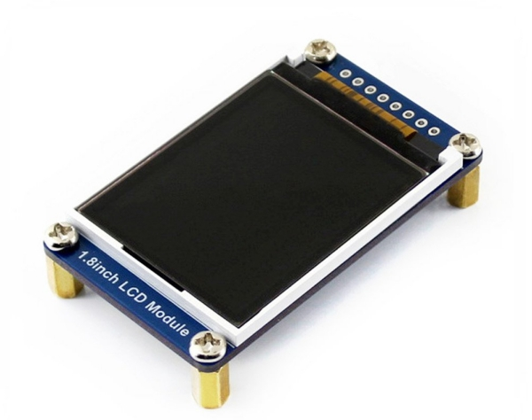

# Raspberry Pi LCD support via ST7735



This library provides the ST7735 class allowing the initialization and reset of the LCD display, and
sending image data.

This library improves on most of the others by:

1. Supporting the 'window' capabilities of the ST7735 chip such that sub-areas if the LCD can be independently
updated. This can be *much* faster than the common approach of always updating the whole screen.

2. Use a block-based SPI data transfer to update the selected window or whole screen. Other libraries commonly
have a function to update a single pixel and then use nested for loops to paint all the pixels on the LCD one
at a time.

3. Using numpy to convert a normal Python '888' 3-bytes-per-pixel RGB image to the '565' 16-bit format used by
the LCD. This is faster than the 'for loop' iterate-and-convert method common elsewhere.

4. A 'Bar' (for bar chart) object is provided which can very efficiently add columns to a horizontal bar chart using
narrow vertical windows on the LCD. This can easily keep up with data sampled at e.g. 10 times/second where the
full LCD width will represent 16 seconds.


## Sources

This library combines the efforts of a few previous authors, including:

https://github.com/cskau/Python_ST7735/blob/master/ST7735/ST7735.py


## Installation

Via raspi-config enable SPI support.

Install python spidev library

```pip install spidev```

## Library info

### Create an ST7735 object:

```
from st7735_ijl20.st7735 import ST7735
lcd = ST7735()
```
This example assumes you are using the default pins
```
LCD_RST_PIN         = 27
LCD_DC_PIN          = 25
LCD_CS_PIN          = 8
LCD_BL_PIN          = 24
```
with SPI also using the default Pi pins.

The object instantiation will also reset the LCD display.

### Initialize the LCD screen

```
lcd.begin()
```

### Display a full-screen image

```
from PIL import Image
image = Image.open('pot.bmp')
lcd.display(image)
```
In this example the image must be 160x128 RGB with 24-bit (i.e. 3 byte) pixels.

### Display an image in a 'window' on the display

Here is an example taken from the Sensor class, which writes a variable 'value' as a number
in a window on the display.

The technique is to use the pillow library (i.e. PIL) to create an image the same size as the window (in
this case 160x48), again use pillow to add text to that image, and send the completed image to the LCD.

In this example the text is right-justified in the window by finding the width of the completed text and
using that to calculate the necessary starting x coordinate to ensure right-justification.

```
from PIL import Image
from PIL import ImageDraw
from PIL import ImageFont
from PIL import ImageColor

FONT = ImageFont.truetype('fonts/Ubuntu-Regular.ttf', 40)

# Window coordinates (0,0) is the top-left corner of the LCD
X = 0
Y = 80
HEIGHT = 48
WIDTH = 160
FG_COLOR = "WHITE"
BG_COLOR = "BLUE"
RIGHT_MARGIN = 10

image = Image.new( "RGB", ( WIDTH, HEIGHT), BG_COLOR)

draw = ImageDraw.Draw(image)

# convert 'value' to string with fixed 5 digits including 1 decimal place, max 9999.9

display_number = value

if display_number >= 10000:
    display_number = 9999.9

draw_string = "{:5.1f}".format(display_number) # 10 points for witty variable name

# calculate x coordinate necessary to right-justify text
string_width, string_height = draw.textsize(draw_string, font=FONT)

# embed this number into the blank image we created earlier
draw.text((WIDTH - string_width-RIGHT_MARGIN, 0),
        draw_string,
        fill = FG_COLOR,
        font=FONT)

# display image on screen at coords x,y. (0,0)=top left.
LCD.display_window(image, X, Y, WIDTH, HEIGHT)
```

### Using a chart

```
from st7735_ijl20.st7735 import ST7735
lcd = ST7735()

# parameters for a 160x40 bar chart on display
CHART_CONFIG = { "x": 0, "y": 0, "w": 160, "h": 40, # top-left coords and width, height.
                "step": 1                         # how many pixels to step in x direction for next()
              }

chart = lcd.add_chart(CHART_CONFIG)

for i in range(200):
    chart.next(i % 30)

```
