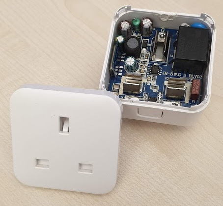
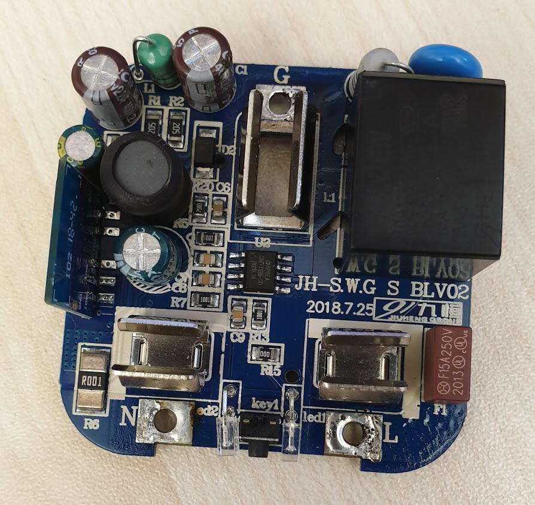
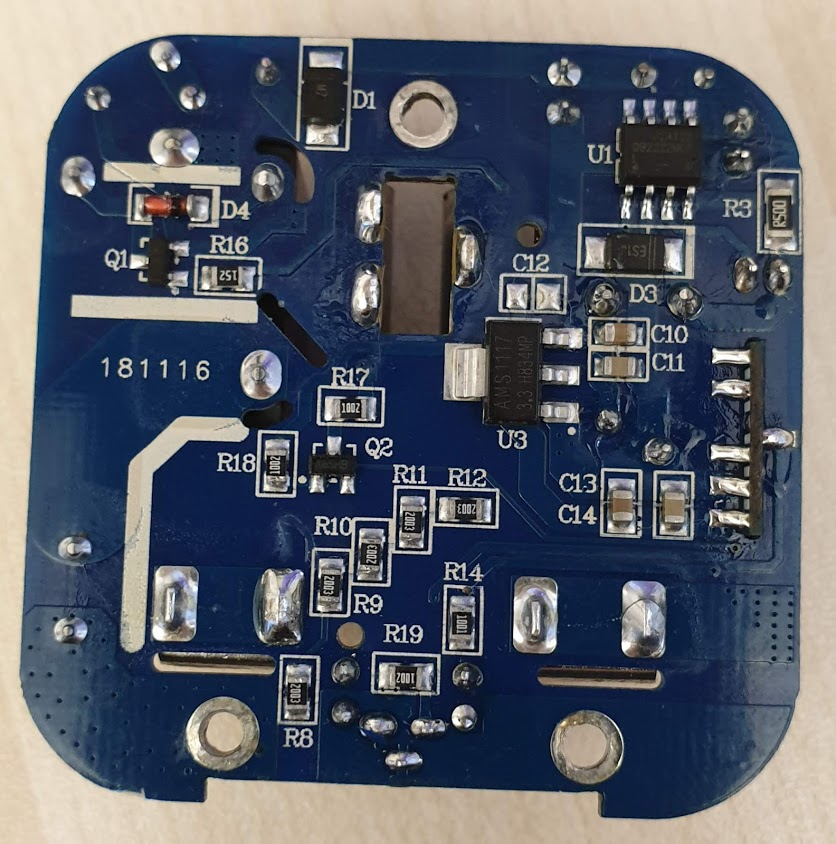
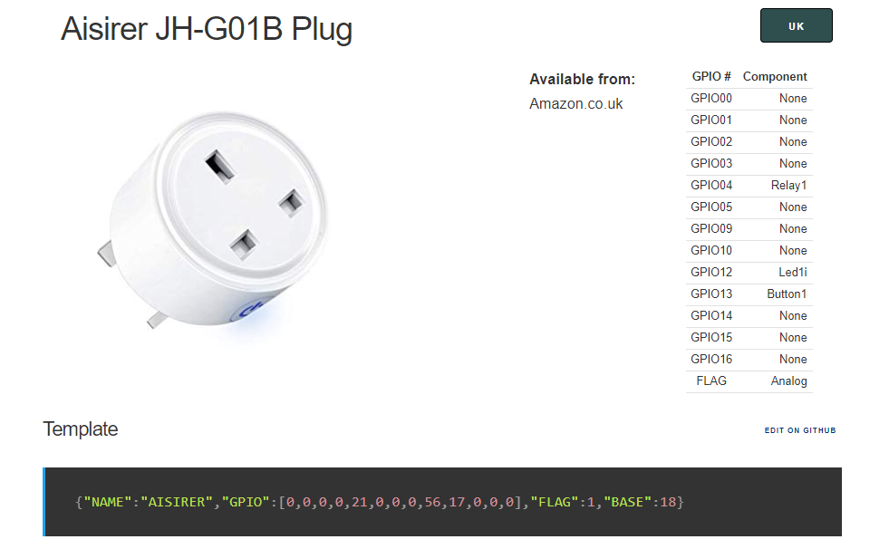

# 'Remote' sensors connecting to the Sensor Node

[A list of smart devices that can be flashed with Tasmota](https://blakadder.github.io/templates)

[Tasmota firmware installation and configuration](tasmota/README.md)

## Anoopsyche JH-G01B1 smart plug







### Tasmota Config Template
```
{"NAME":"JH-G01B1","GPIO":[0,145,0,146,0,0,0,0,17,56,21,0,0],"FLAG":0,"BASE":41}
```

## Avatar (aka Aisirer) AWP14H smart plug



### Tasmota Config Template
```
{"NAME":"Avatar UK 10A","GPIO":[0,0,56,0,0,134,0,0,131,17,132,21,0],"FLAG":0,"BASE":45}
```
